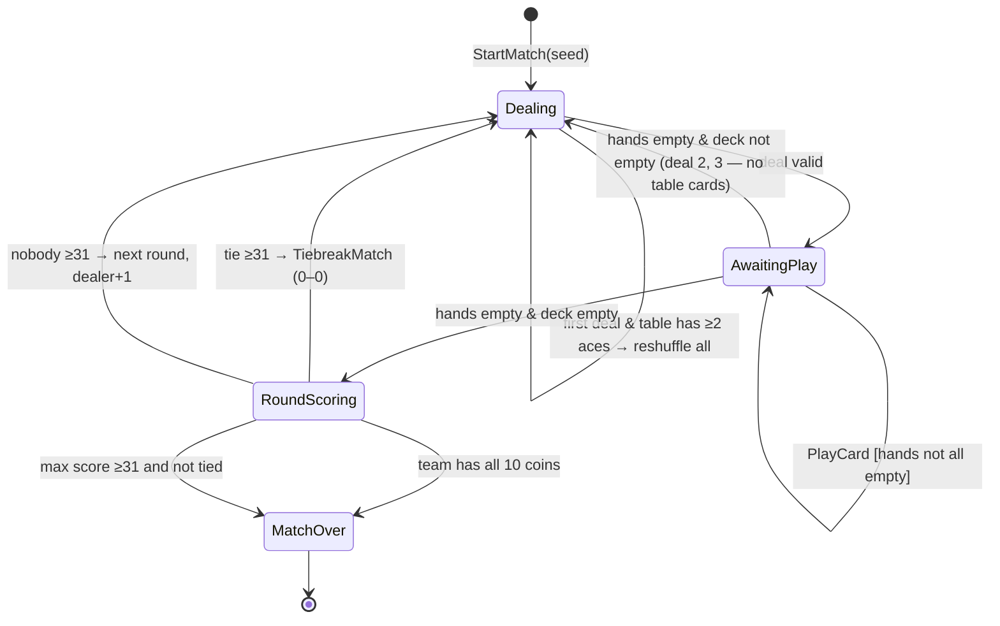

# Spincio — Specifica (Regolamento v1.2)

> **Fonte di verità.** Queste sono le regole di casa dello Spincio (variante dello Spazzino). In caso di conflitto con qualunque altra fonte, vale questo documento.
> Ogni modifica alle regole richiede: aggiornamento di questo file, nuova versione del regolamento, test `AT-xx` corrispondenti.

## Changelog

| Versione | Data | Modifica |
|---|---|---|
| v1.1 | 24/09/2026 | Regolamento confermato (Fasi 0–3) |
| v1.2 | 25/09/2026 | **Chiarimento F7** (confermato dal proprietario): vale anche nelle partite di spareggio. **Correzione di una deduzione** in §5 (invariante sulle carte di pari valore). `NewMatch` restituisce una `Transition`. Nessuna regola di gioco cambiata. |

## 0. Notazione

Carte nei test: rango `A,2,3,4,5,6,7,J,N,K` (J = fante, N = cavallo, K = re) + seme `D,C,S,B` (Denari, Coppe, Spade, Bastoni).
Esempi: `KD` = re di denari (**rebello**), `7D` = **settebello**.

## 1. Regolamento

### 1.1 Setup
| ID | Regola |
|---|---|
| S1 | Mazzo da briscola da 40 carte, grafica **piacentina**. Valori: asso–7 = 1–7, fante 8, cavallo 9, re 10. |
| S2 | **2v2**: i compagni siedono uno di fronte all'altro; si gioca in senso **antiorario**. Squadra A = posti 0 e 2, squadra B = posti 1 e 3. |
| S3 | Il primo mazziere è casuale; alla smazzata successiva passa al giocatore seguente in senso antiorario. |
| S4 | Prima distribuzione: 3 carte a testa + 4 scoperte in tavola. Poi 3 a testa quando le mani sono vuote: 3 distribuzioni e 36 giocate per smazzata. |
| S5 | Se in tavola ci sono **almeno 2 assi**, si ridistribuisce: si rimescola tutto (mani comprese) e si ridistribuisce, stesso mazziere, RNG deterministico. |
| S6 | Inizia il giocatore dopo il mazziere. |

### 1.2 Prese
| ID | Regola |
|---|---|
| P1 | Si prende per **uguaglianza** di valore oppure per **somma** di 2 o più carte. **Anche le figure** prendono per somma (es. K prende 7+3; K prende J+2). |
| P2 | Se in tavola c'è una carta di valore uguale, bisogna prendere quella: la somma è vietata. Con più carte uguali se ne prende **una sola**, a scelta. |
| P3 | Tra più prese per somma possibili **sceglie il giocatore**. |
| P4 | **Obbligo di presa sulla carta giocata:** si può giocare qualunque carta; se quella carta può prendere, deve prendere. Si può quindi calare una carta che non prende anche se un'altra carta in mano prenderebbe. |
| P5 | Nessuna presa doppia (uguaglianza + somma) nella stessa giocata. |
| P6 | **Spazzino** (la presa svuota la tavola) = **1 punto**. **Non vale** con l'ultima giocata della smazzata. |
| P7 | Le carte rimaste in tavola a fine smazzata vanno alla squadra che ha preso per ultima; non è spazzino. Se nessuno ha preso in tutta la smazzata, non vanno a nessuno. |

### 1.3 Accusi (punti della mano)
| ID | Regola |
|---|---|
| A1 | A **ogni distribuzione**: somma dei valori della mano **≤ 9** = 2 punti, oppure **3** se ci sono esattamente due carte dello stesso rango (coppia). **Tris** = 7 punti. Si cumulano: 3-3-3 = 7+2 = 9 (non 7+3). |
| A2 | I punti vanno alla **squadra**. |
| A3 | Si dichiarano con un **pulsante**, attivo solo se la mano vale punti. Si può dichiarare **solo nel proprio turno, prima di giocare la propria prima carta** di quella distribuzione; se non si dichiara, i punti sono persi. |
| A4 | Gli altri vedono **solo tipo e punti** dell'accuso, mai le carte. |

### 1.4 Fine smazzata (1 punto ciascuno; in caso di pari, 0)
| ID | Regola |
|---|---|
| F1 | Più carte. |
| F2 | Più denari. |
| F3 | Rebello (`KD`). |
| F4 | Settebello (`7D`). |
| F5 | Primiera = **più 7**. |
| F6 | **Napola di denari**: scala consecutiva che parte dall'asso (A,2,3,4,5,6,7,J,N,K), lunga almeno 3 carte; vale quanto la sua lunghezza (A–5 = 5). |
| F7 | **Tutti i 10 denari** presi = **vittoria immediata** della partita, qualunque sia il punteggio. Vale anche nelle partite di spareggio. |
| — | Tutti i punti si **cumulano** (il `7D` conta per denari, settebello, primiera e napola). |

### 1.5 Fine partita
| ID | Regola |
|---|---|
| E1 | Si controlla **solo a fine smazzata**. Si vince a **31**; se entrambe le squadre sono a 31 o più, vince chi ha di più. |
| E2 | Pareggio esatto a 31 o più → **partita di spareggio** intera da 0–0 (il mazziere continua la rotazione), ripetuta finché qualcuno vince. |
| E3 | Le carte prese **non sono visibili a nessuno**, nemmeno le proprie. Il **punteggio è sempre visibile** e si aggiorna subito per spazzini e accusi. A fine smazzata c'è un riepilogo dettagliato dei punti. |

### 1.6 Backlog regole (fuori dall'MVP, da raccogliere)
- **Spincione:** due mazzi, con regole proprie tra cui il **bàgher**.
- Modalità tutti contro tutti a 3.
- Altri mazzi regionali.

## 2. Glossario → codice

| Italiano | Codice |
|---|---|
| Carta / Seme / Rango | `Card` / `Suit {Coins, Cups, Swords, Clubs}` / `Rank {Ace=1..Seven, Jack, Knight, King}` (`Value = (int)Rank`) |
| Posto / Squadra / Mazziere | `Seat(0..3)`, `next = (s+1) % 4` / `Team {A, B}` / `Dealer` |
| Distribuzione / Smazzata / Partita / Spareggio | `Deal` / `Round` / `Match` / `TiebreakMatch` |
| Giocata / Presa / Calata / Spazzino | `Play` / `Capture` / `Drop` / `Sweep` |
| Accuso / Napola / Primiera / Rebello / Settebello | `Declaration` / `Napola` / `Primiera` / `Rebello` / `Settebello` |

## 3. Modello (bozza)

```csharp
public enum Suit { Coins, Cups, Swords, Clubs }
public enum Rank { Ace = 1, Two, Three, Four, Five, Six, Seven, Jack, Knight, King }
public readonly record struct Card(Rank Rank, Suit Suit);
public readonly record struct Seat(int Index) { public Team Team => Index % 2 == 0 ? Team.A : Team.B; }
[Flags] public enum DeclarationKind { None = 0, LowSum = 1, LowSumWithPair = 2, ThreeOfAKind = 4 }

public abstract record Command(Seat Seat);
public sealed record PlayCard(Seat Seat, Card Card, CaptureOption? Capture) : Command(Seat);
public sealed record Declare(Seat Seat) : Command(Seat);

public static class SpincioEngine
{
    // Restituisce una Transition (non solo lo stato) per non perdere gli eventi della prima distribuzione.
    public static Transition NewMatch(ulong seed, Seat? firstDealer = null);
    public static Result<Transition> Apply(MatchState state, Command command);
    public static IReadOnlyList<Command> LegalCommands(MatchState state, Seat seat);
    public static PlayerView ViewFor(MatchState state, Seat seat);
}
public sealed record Transition(MatchState State, ImmutableArray<GameEvent> Events);
// Ogni GameEvent dichiara la propria Audience (All / Only(seat)).
```

## 4. Macchina a stati



## 5. Algoritmo delle prese

```
CaptureOptions(played, table):
  v = played.Value
  equal = { {t} : t ∈ table, t.Value == v }
  if equal ≠ ∅: return equal                      // P2
  return { S ⊆ table : |S| ≥ 2, Σ S.Value == v }  // P1, P3 (DFS con potatura sulla somma)

LegalPlays(hand, table):
  for card in hand:
    opts = CaptureOptions(card, table)
    if opts == ∅: yield Drop(card)
    else: for o in opts: yield Capture(card, o)   // P4
```

- Le opzioni sono insiemi di **carte**, non di valori.
- **Invariante (deduzione, corretta in v1.2):** due carte di pari valore possono stare insieme in tavola **solo se entrambe vengono dalla tavola iniziale** della smazzata. Una carta calata non può mai avere lo stesso valore di una carta in tavola, altrimenti avrebbe dovuto prendere (P2, P4). La formulazione precedente ("dopo la prima giocata non ci sono carte di pari valore") era sbagliata: se la tavola iniziale è `[5C,5S,…]` e il primo giocatore cala un `K` che non prende, i due 5 restano in tavola.
- **Dopo una presa:**
  1. le carte vanno nel mazzetto della squadra;
  2. `LastCapturingTeam` = squadra del giocatore;
  3. se la tavola è vuota e non è la 36ª giocata → +1 spazzino.

## 6. Casi limite

| # | Caso | Comportamento |
|---|---|---|
| C1 | Tavola vuota | Qualunque carta si cala |
| C2 | In tavola c'è una carta uguale e anche una somma possibile | Solo uguaglianza |
| C3 | Due carte uguali in tavola (solo tavola iniziale) | Se ne prende una, a scelta |
| C4 | Una carta in mano prende, un'altra no | Si può calare quella che non prende; quella che prende non si può calare |
| C5 | Spazzino all'ultima giocata | Si prendono le carte, lo spazzino non vale |
| C6 | Calata all'ultima giocata | Tavola e carta calata vanno a chi ha preso per ultimo |
| C7 | Nessuno prende in tutta la smazzata | Carte rimaste a nessuno |
| C8 | Tavola iniziale con 2, 3 o 4 assi | Si rimescola tutto, stesso mazziere |
| C9 | Accuso non dichiarato prima della propria prima giocata | Perso |
| C10 | Mano da 0 punti | `Declare` illegale |
| C11 | Una squadra arriva a 31 a metà smazzata | Si continua |
| C12 | Tutti i denari presi, ma l'avversario ha più punti | Vince chi ha i denari |
| C13 | Pareggi 20–20 carte, 5–5 denari, 2–2 sette | 0 punti |
| C14 | Napola con buchi o senza asso | 0 punti |
| C15 | Pareggio a 31 o più ripetuto | Altro spareggio |

## 7. Test di accettazione

Ogni test nel codice porta lo stesso ID (es. `AT_05_equal_value_forbids_sum`).

### Setup e determinismo
- **AT-01** Nuova smazzata → ogni posto ha 3 carte, la tavola 4, il mazzo 24.
- **AT-02** Seed con 2 o più assi in tavola → si rimescola finché la tavola ha al massimo 1 asso; con lo stesso seed lo stato finale è identico.
- **AT-03** Mazziere al posto 1 → gioca per primo il posto 2; alla smazzata successiva il mazziere è il posto 2.
- **AT-04** Stesso seed + stessi comandi → stati ed eventi identici.

### Prese
- **AT-05** Tavola `[5C,3S,2B]`, gioco `5D` → unica opzione `{5C}`; `{3S,2B}` non ammessa.
- **AT-06** Tavola `[4C,3S,6B]`, gioco `7D` → `{4C,3S}`.
- **AT-07** Tavola `[AC,6S,2B,5D]`, gioco `7C` → opzioni `{AC,6S}` e `{2B,5D}`, sceglie il giocatore.
- **AT-08** Tavola `[7C,3S]`, gioco `KB` → prendo `{7C,3S}`.
- **AT-09** Tavola `[JC,2S]`, gioco `KD` → prendo `{JC,2S}`.
- **AT-10** Tavola `[5C,5S]`, gioco `5D` → opzioni `{5C}` oppure `{5S}`, mai entrambe.
- **AT-11** Mano `[7D,KC]`, tavola `[3S,4B]` → calare `KC` è legale; calare `7D` è illegale; `7D` con `{3S,4B}` è legale.
- **AT-12** Tavola `[6C]`, gioco `3S` → `3S` resta in tavola.

### Spazzino e fine smazzata
- **AT-13** Tavola `[3S,4B]`, non è l'ultima giocata, gioco `7D` → +1 spazzino alla squadra.
- **AT-14** Stessa situazione all'ultima giocata → prendo le carte, lo spazzino non vale.
- **AT-15** Ultima presa della squadra B, restano `[2C,6S]` → vanno alla squadra B, senza spazzino.

### Accusi
- **AT-16** Punti per mano: `A-3-5` → 2 · `2-2-5` → 3 · `2-2-6` → 0 · `3-3-3` → 9 · `5-5-5` → 7 · `K-K-K` → 7 · `A-A-7` → 3 · `K-2-A` → 0.
- **AT-17** Mano da 0 punti → `Declare` illegale.
- **AT-18** Il posto 2 ha un accuso valido ma tocca al posto 1 → `Declare(2)` illegale. Arriva il turno del posto 2 → `Declare(2)` legale finché il posto 2 non gioca. Il posto 2 gioca senza dichiarare → accuso perso per quella distribuzione.
- **AT-19** Accuso dichiarato → gli altri vedono solo tipo e punti.
- **AT-20** Accuso valido alla 2ª distribuzione → dichiarabile anche lì.

### Punti di fine smazzata
- **AT-21** Carte 21–19 → +1 alla squadra con 21; 20–20 → 0.
- **AT-22** Denari 6–4 → +1; 5–5 → 0.
- **AT-23** `KD` e `7D` nel mazzetto della squadra A → +1 e +1 alla squadra A.
- **AT-24** Sette 3–1 → +1 primiera; 2–2 → 0.
- **AT-25** Napola: `A,2,3` → 3 · `A…5` → 5 · `A,2,4` → 0 · `2,3,4` → 0 · `A…N` → 9.
- **AT-26** La squadra A ha tutti i 10 denari → vince la partita anche se B ha più punti.

### Fine partita
- **AT-27** A a 29 dichiara un accuso da 3 punti a metà smazzata → la partita non finisce prima della fine della smazzata.
- **AT-28** 33–32 a fine smazzata → vince A.
- **AT-29** 31–20 → vince A.
- **AT-30** 32–32 → spareggio da 0–0; se finisce ancora pari, un altro spareggio.

### Informazioni nascoste
- **AT-31** La `PlayerView` contiene: la propria mano, la tavola, il punteggio, gli accusi dichiarati (tipo e punti), il numero di carte in mano agli altri. **Non** contiene nessun mazzetto di carte prese.
- **AT-32** Nessuno ha preso in tutta la smazzata → le carte rimaste in tavola non vanno a nessuno; contano solo le altre voci.
